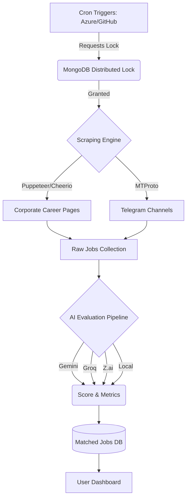
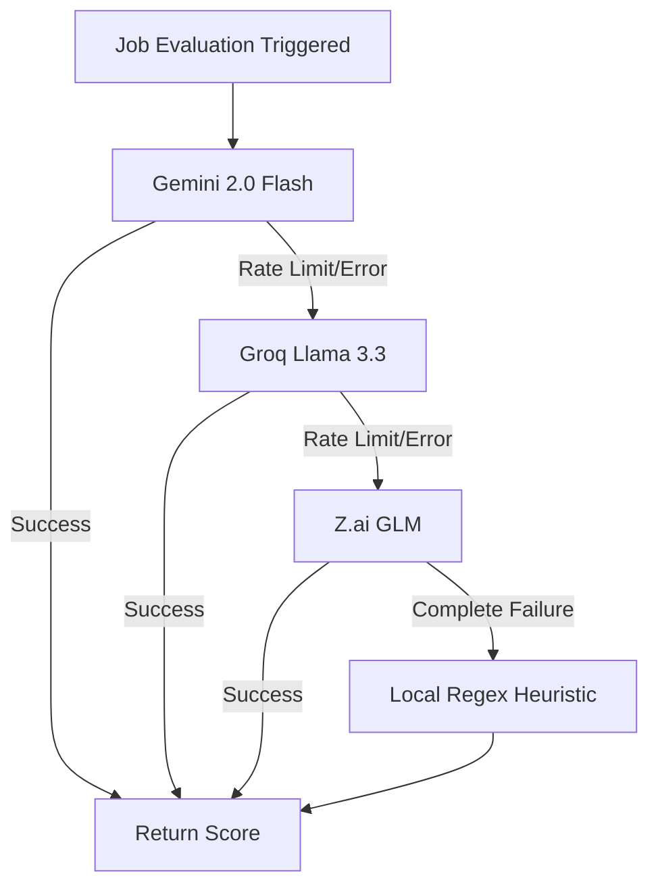
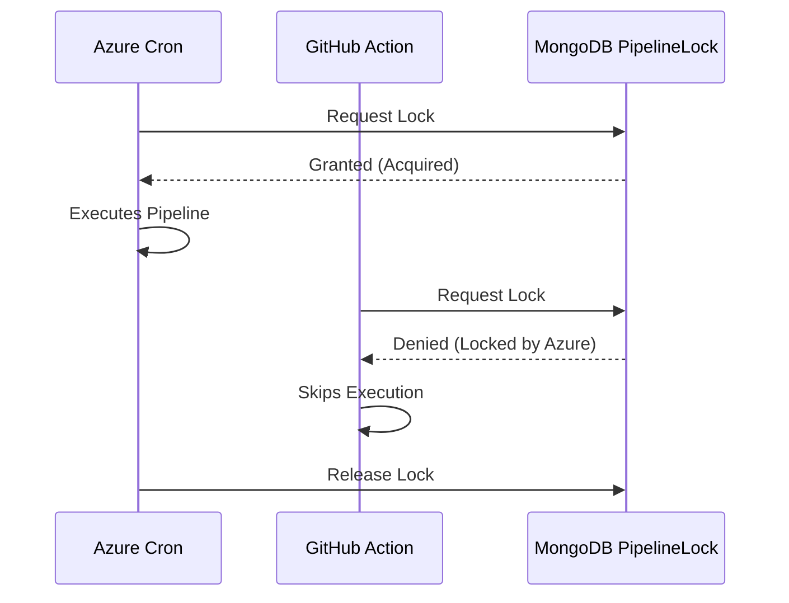
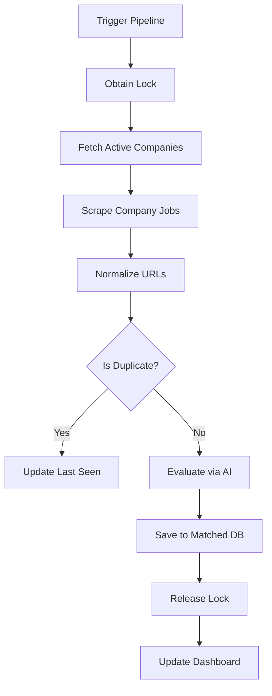
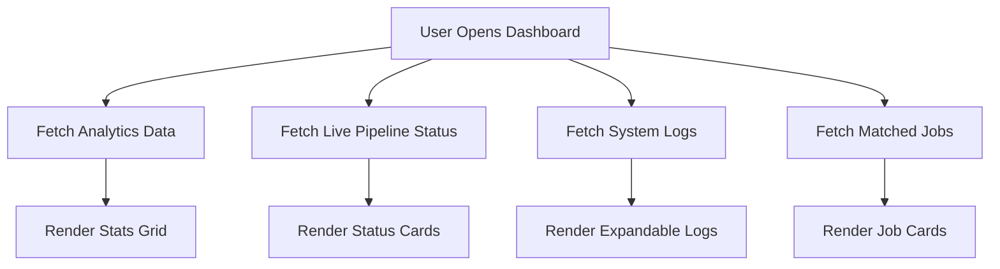
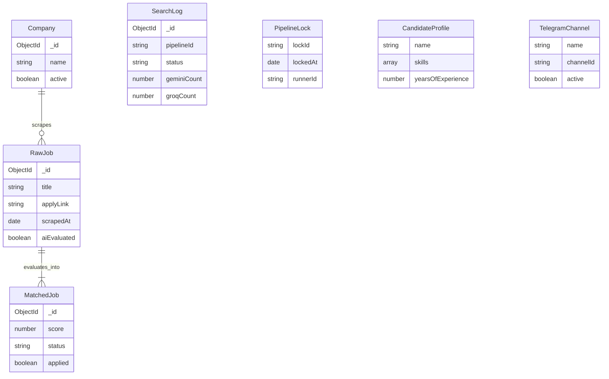

<div align="center">
  
  
  
  
  
  
  
  
</div>

<h1 align="center">RoleNova</h1>
<h4 align="center">Automated Job Discovery & Evaluation Pipeline</h4>

<p align="center">
  <b>RoleNova</b><br/>
  <a href="https://github.com/vbv0507/jobfinder">Repository</a>
</p>
<p align="center">
  <b>Monitorly (API Monitoring System)</b><br/>
  <a href="https://github.com/vbv0507/api-monitoring-system">Repository</a> • <a href="https://monitorly-ahcrd4h6bydndscw.centralindia-01.azurewebsites.net/">Live Demo</a>
</p>

---

## 📖 Overview

**RoleNova** is an automated pipeline that discovers, extracts, deduplicates, and evaluates software engineering job postings.

**Problem:** Job boards often contain irrelevant roles or mismatched experience requirements. Manually filtering these postings takes time.

**Solution:** This project monitors corporate career websites and Telegram channels, normalizes the extracted job data, and evaluates postings against a candidate profile using LLMs.

**Why AI?** Keyword matching often misses context (e.g., "Must have 5+ years" vs. "Bonus: 5+ years"). RoleNova uses LLMs to parse domains, graduation requirements, skills, and employment levels to score roles.

---

## ✨ Key Features

### 🧠 AI
- **Gemini Evaluation**: Primary engine for candidate-to-job matching.
- **Groq Fallback**: Fails over to Llama 3.3 70B if Gemini returns errors.
- **Z.ai Fallback**: Tertiary fallback (GLM).
- **Local Heuristic**: Regex-based evaluation if all API providers fail.
- **AI Match Score**: Assigns a 0-100 score and categorizes jobs based on relevance.

### 🔍 Job Aggregation
- **Multi-company scraping**: Supports Workday, Greenhouse, and custom ATS platforms.
- **Telegram ingestion**: Parses job updates from Telegram channels.
- **URL normalization**: Removes tracking parameters to avoid duplicate processing.
- **Duplicate detection**: Uses MD5 hashes to identify and skip existing jobs.
- **Applied Job Preservation**: Retains state for jobs marked as "Applied."

### ⚙️ Pipeline
- **Azure Cron**: Triggered on a schedule by Azure infrastructure.
- **GitHub Actions**: Alternative cron trigger.
- **Manual Trigger**: UI-based manual start.
- **Distributed MongoDB Lock**: Prevents multiple triggers from executing the pipeline concurrently.
- **Concurrent Scraping**: Uses `p-limit` to manage concurrency for corporate site requests.

### 📊 Dashboard
- **Analytics**: Tracks counts for Scraped, Evaluated, Matched, Applied, and Rejected jobs.
- **Pipeline Monitoring**: Displays the current stage of the scraping engine.
- **AI Provider Monitoring**: Logs requests and fallback counts per provider.
- **Company Statistics**: Breakdown of job yields by company.
- **System Logs**: UI for viewing pipeline logs and runtimes.

### 📈 Monitoring
- **Search Logs**: MongoDB documents containing execution metrics and stack traces.
- **Pipeline Telemetry**: Live metrics exposed via an API for the UI.
- **AI Telemetry**: Tracks provider error types (temporary vs. permanent).

---

## 🏛️ Architecture

### Overall Architecture


### AI Evaluation Flow


### Distributed Lock


### Pipeline Flow


### Dashboard Flow


---

## 📂 Folder Structure

```text
├── controller/         # Request handlers
├── cron/               # Pipeline execution logic and lock handling
├── models/             # Mongoose schemas
├── public/             # Static frontend assets
├── routes/             # Express API route definitions
├── scripts/            # Database maintenance scripts
├── services/           # AI services and scraping logic
├── utils/              # Helper functions and normalizers
├── views/              # EJS templates for the UI
├── .env.example        # Environment variable template
└── index.js            # Express application entry point
```

---

## 🛠️ Technology Stack

| Category | Technologies |
| :--- | :--- |
| **Frontend** | EJS Templates, Vanilla JS, Tailwind CSS |
| **Backend** | Node.js, Express.js |
| **Database** | MongoDB (Mongoose) |
| **AI Providers** | Google Gemini, Groq, Z.ai |
| **Deployment** | Azure App Service |
| **Automation** | GitHub Actions, Azure Cron |
| **Libraries** | Axios, Cheerio, Puppeteer, p-limit |

---

## 🧠 AI Evaluation Pipeline

RoleNova uses multiple AI providers to handle rate limits and availability issues.

```
Gemini ➝ Groq ➝ Z.ai ➝ Local
```

- **Temporary failures**: Timeout or `502 Bad Gateway` errors skip to the next provider for the current job but keep the failing provider available for subsequent jobs.
- **Permanent failures**: Authentication or quota errors (`401`, `429`) disable the affected provider for the remainder of the pipeline run.
- **Fallback strategy**: If all APIs fail, evaluation defaults to a regex-based local heuristic.

---

## 🔒 Distributed Lock

When using multiple triggers (like Azure Cron and GitHub Actions), overlapping executions can cause duplicate processing.

- **MongoDB Lock**: Ensures only one trigger can run the scraping pipeline at a time.
- **TTL Recovery**: Lock documents include a time-to-live (TTL). If a process crashes, the lock expires automatically, allowing subsequent runs to proceed.

---

## 🔄 Pipeline Workflow

1. **Company scraping**: Fetches jobs using Cheerio, falling back to Puppeteer for dynamic sites.
2. **Job extraction**: Parses titles, locations, and apply links.
3. **Deduplication**: Normalizes URLs and checks MD5 hashes against existing records.
4. **AI evaluation**: Sends the job description through the provider chain.
5. **Database**: Saves the results to MongoDB.
6. **Dashboard**: Updates the pipeline state for the frontend.

---

## 🗄️ Database

- **Company**: Stores target URLs and ATS configurations.
- **RawJob**: Stores normalized raw scrape data.
- **MatchedJob**: Jobs that pass the AI evaluation.
- **SearchLog**: Telemetry logs for each pipeline run.
- **PipelineLock**: Manages distributed mutex logic.
- **TelegramChannel**: Configurations for Telegram ingestion.
- **CandidateProfile**: User skills and preferences used in the AI prompt.

### ER Diagram


---

## 🧪 Telegram Test Mode

A dedicated deterministic testing mode allows you to verify the entire Telegram ingestion and evaluation pipeline without relying on random job postings from production channels or impacting real data analytics.

**Why it exists:** Provides a clean, isolated environment to ensure the listener, parser, AI evaluation, and MongoDB ingestion work flawlessly when updates are made to the pipeline.

**Configuration:**
1. Create a **Public** Telegram channel (e.g., `@RoleNovaTestJobs`).
2. Add the following to your environment variables (`.env` or Azure App Settings):
   ```env
   TELEGRAM_TEST_MODE=true
   TELEGRAM_TEST_CHANNEL=@RoleNovaTestJobs
   ```
3. Restart the application. 
4. Post a test message in your channel. The pipeline will process it normally but tag the logs with `[Telegram Test]`.

**Disabling:**
Set `TELEGRAM_TEST_MODE=false` or remove it from the environment entirely. Restart the application to resume listening to production channels configured in MongoDB.

---

## ⚡ API Endpoints

| Method | Endpoint | Description |
| :--- | :--- | :--- |
| `GET` | `/api/jobs/matched` | Retrieves paginated matched jobs |
| `GET` | `/api/jobs/analytics` | Fetches dashboard metrics |
| `GET` | `/api/jobs/logs` | Retrieves system logs |
| `GET` | `/api/jobs/status` | Polling endpoint for pipeline state |
| `POST` | `/api/jobs/run` | Manually triggers the pipeline |
| `PATCH` | `/api/jobs/:id/status` | Updates job status (e.g., Applied) |
| `DELETE`| `/api/jobs/raw` | Clears unmatched raw jobs |
| `GET` | `/api/telegram/status` | Checks Telegram client status |
| `POST` | `/api/companies/seed` | Seeds initial target companies |

---

## 🔐 Environment Variables

| Variable | Description |
| :--- | :--- |
| `PORT` | Application server port |
| `MONGO_URI` | MongoDB Connection String |
| `GEMINI_API_KEY` | Google Gemini API Key |
| `GEMINI_MODEL` | Gemini Model Name |
| `GROQ_API_KEY` | Groq API Key |
| `GROQ_MODEL` | Groq Model Name |
| `ENABLE_GROQ_FALLBACK` | Toggle Groq Provider |
| `ZAI_API_KEY` | Z.ai API Key |
| `ZAI_MODEL` | Z.ai Model Name |
| `ZAI_BASE_URL` | Z.ai API Endpoint |
| `ENABLE_ZAI_FALLBACK` | Toggle Z.ai Provider |
| `ENABLE_LOCAL_MATCH_FALLBACK` | Toggle local regex fallback |
| `TELEGRAM_API_ID` | Telegram API ID |
| `TELEGRAM_API_HASH` | Telegram API Hash |
| `TELEGRAM_SESSION` | Persistent Telegram Session String |
| `TELEGRAM_HEALTH_ENABLED` | Toggle Telegram Health Check Command |
| `TELEGRAM_HEALTH_COMMAND` | Custom Command for Health Check (e.g. #RN_HEALTH) |
| `TELEGRAM_HEALTH_ALLOWED_USERS` | Comma separated user IDs allowed to perform Health Check |

---

## 🚀 Installation

1. **Clone**
   ```bash
   git clone https://github.com/vbv0507/jobfinder.git
   cd jobfinder
   ```
2. **Install dependencies**
   ```bash
   npm install
   ```
3. **Configure Environment**
   Copy `.env.example` to `.env` and set your variables.
4. **Configure MongoDB**
   Point `MONGO_URI` to a MongoDB instance. Use `/api/companies/seed` to populate the company list.
5. **Run**
   ```bash
   npm start
   ```

---

## 💻 Usage

- **Manual Pipeline**: Use the "Start Pipeline" button on the dashboard to scrape jobs.
- **Automatic Pipeline**: Set up a CRON job in Azure or GitHub Actions.
- **Dashboard**: View analytics, track scraped jobs, and update job statuses.
- **Telegram**: Configure MTProto variables to ingest jobs from Telegram.
- **AI Evaluation**: Update the Candidate Profile to improve matching accuracy.

---

## 🏎️ Performance Optimizations

- **Distributed Lock**: Prevents duplicate executions across different environments.
- **Concurrent scraping**: Uses `p-limit` to fetch from multiple websites in parallel.
- **URL normalization**: Removes tracking tags (`?utm_source`, etc.) before hashing.
- **Deduplication**: Hashes normalized URLs to prevent redundant API calls.
- **AI fallback chain**: Handles API rate limits by switching providers.
- **Database indexes**: Uses indexes on URLs and status fields for faster queries.

---

## 🚨 Error Handling

- **AI failures**: Differentiates between temporary errors (e.g., timeouts) and permanent errors (e.g., quota exceeded).
- **Fallback mechanism**: Routes requests to the next available provider on failure.
- **Lock recovery**: MongoDB documents use a TTL index to release orphaned locks.
- **Pipeline recovery**: Wraps scraping loops in try-catch blocks to prevent a single failure from halting the run.
- **Logging**: Execution details and errors are saved to the `SearchLog` collection.

---

## ☁️ Deployment

- **Azure App Service**: Compatible with Azure App Service deployment.
- **GitHub Actions**: Pipeline can be triggered via scheduled GitHub Actions.
- **Environment Variables**: Configure secrets in Azure App Settings or GitHub Secrets.

---

## 🔮 Future Enhancements

- Webhook integration for instant notifications on highly scored jobs.
- Automated resume submission for standard ATS platforms.

---

## 🤝 Contributing

Pull requests are welcome. For major changes, please open an issue first to discuss what you would like to change.

1. Fork the Project
2. Create your Feature Branch (`git checkout -b feature/AmazingFeature`)
3. Commit your Changes (`git commit -m 'Add some AmazingFeature'`)
4. Push to the Branch (`git push origin feature/AmazingFeature`)
5. Open a Pull Request

---

## 📄 License

Distributed under the [MIT License](./LICENSE).

---

## 👨‍💻 Author

**Vaibhav Rai**  
B.Tech Information Technology  
Parul University  

- [GitHub Profile](https://github.com/vbv0507)
- [LinkedIn Profile](https://www.linkedin.com/in/vaibhav-rai-ab6b17270/)
- [Email](mailto:vbvrai1407@gmail.com)
