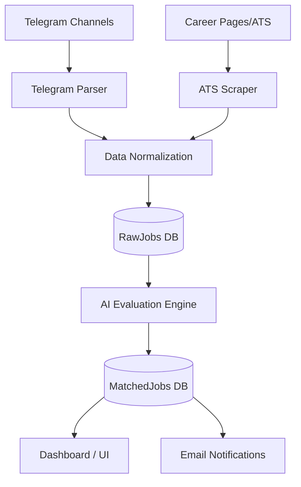
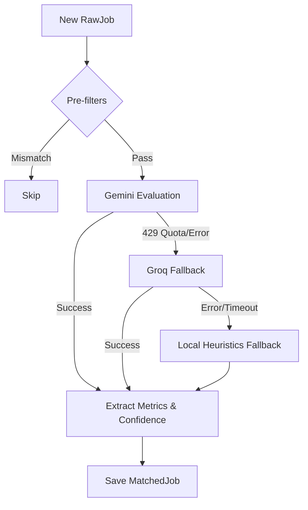
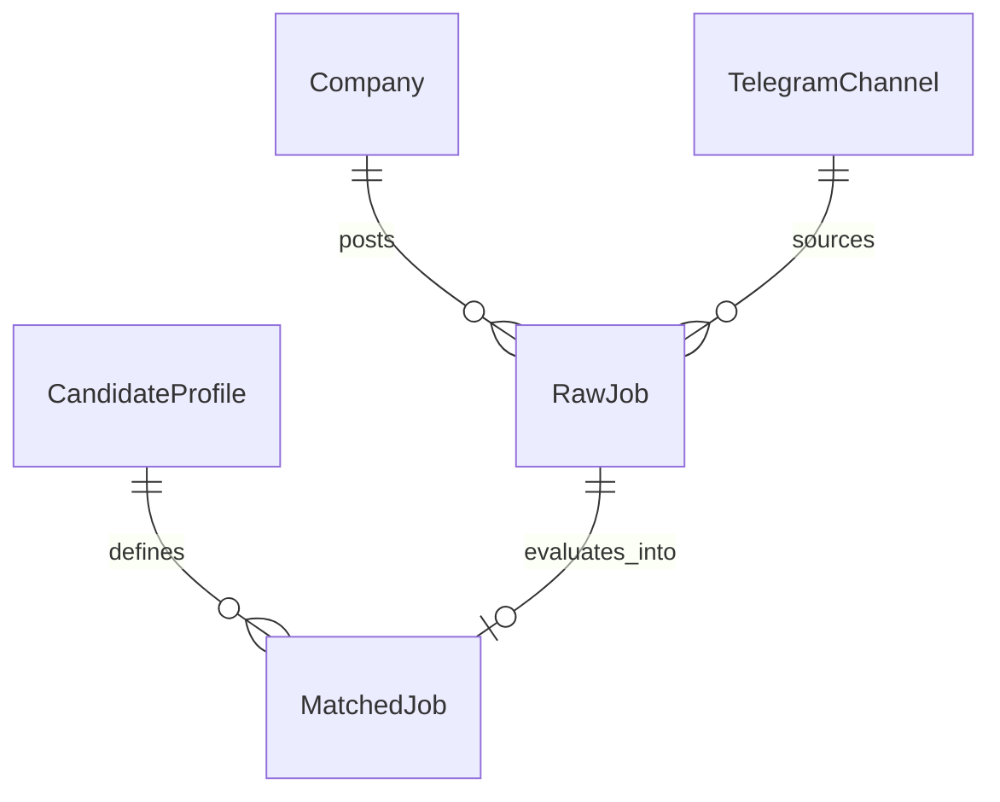

<div align="center">
  <h1>🚀 RoleNova</h1>
  <p><strong>AI-Powered Job Intelligence Platform</strong></p>
  <p>An intelligent, highly automated Applicant Tracking System (ATS) and job discovery engine that ingests opportunities in real-time, evaluates them using large language models, and matches them against dynamic engineering profiles.</p>
</div>

---

---

## ✨ Features

### 🧠 AI Features
- **Explainable AI Matching**: Deep analysis of job descriptions against your exact skills and experience.
- **Multi-LLM Architecture**: Seamless cascading fallbacks between Google Gemini and Groq (Llama 3).
- **Intelligent Scoring**: Weighted scoring breakdowns based on Role, Skills, Experience, Domain, and Location.

### ⚙️ Backend Features
- **Scalable Cron Architecture**: Background job scraping and processing intervals.
- **Robust Deduplication**: Complex URL extraction and normalization to prevent redundant processing.
- **Multi-Source Ingestion**: Unified data pipeline merging standard ATS scrapers and unstructured Telegram messages.

### 📱 Telegram Features
- **MTProto Integration**: Real-time channel monitoring using GramJS.
- **Advanced Regex Parser**: Graceful fallback extraction for unstructured posts (Company, Role, Salary, Experience).
- **Inline Link Resolution**: Direct extraction of hidden HTML/Markdown entity links within Telegram messages.

### 📊 Dashboard & Analytics
- **Real-Time KPIs**: Track jobs scraped, evaluated, matched, applied, and rejected daily.
- **Chart.js Visualizations**: Deep analytics on job domains, match score distributions, and application trends.
- **ATS Workflow Board**: Kanban-style status tracking (New, Saved, Applied, Rejected).

---

## 💻 Technology Stack

| Category | Technologies |
|---|---|
| **Backend** | Node.js, Express.js |
| **Frontend** | HTML5, EJS, Vanilla CSS, Chart.js, TailwindCSS (Utility) |
| **Database** | MongoDB (Mongoose ODM) |
| **AI Providers** | Google Gemini (2.0 Flash), Groq (Llama 3) |
| **Automation** | node-cron, GramJS, Puppeteer / Axios (Scraping) |
| **Libraries** | dotenv, nodemailer, telegram |

---

## 🏗️ System Architecture

### Overall Architecture


### Job Evaluation Pipeline & AI Fallback


### Database Flow


---

## 📁 Folder Structure

```text
rolenova/
├── controllers/      # Route handlers and business logic coordination
├── cron/             # Scheduled background tasks (Scraping, AI Evaluation)
├── models/           # Mongoose schemas (Company, RawJob, MatchedJob, etc.)
├── public/           # Static assets (CSS, client-side JS, images)
├── routes/           # Express router definitions
├── services/         # Core business logic (Gemini, Telegram, Email)
├── utils/            # Helper functions (URL strategies, Domain classification)
├── views/            # EJS templates for the frontend dashboard
├── .env.example      # Environment variable template
├── index.js          # Main application entry point
└── package.json      # Node.js dependencies and scripts
```

---

## 🔄 Core Workflow

1. **Company APIs & Scrapers**: Scheduled cron jobs ping known ATS platforms (Greenhouse, Workday, Lever, etc.) to fetch fresh job postings.
2. **Telegram Ingestion**: GramJS listens in real-time to configured Telegram channels, extracting metadata and nested URLs using regex fallbacks.
3. **Normalization & Deduplication**: Extracted data is routed through a normalization layer. Duplicate links update the `sources` and `lastSeen` properties of existing jobs instead of creating redundant rows.
4. **Candidate Profile Sync**: The dynamic MongoDB candidate profile is loaded to establish baseline engineering constraints (e.g. backend domains, specific tech stacks).
5. **Cascading Evaluation**:
   - The job is fed to **Gemini**. 
   - If quota limits are hit, it falls back to **Groq**. 
   - If Groq fails, it falls back to a **Local Rule Engine**.
6. **Data Persistence**: The final scored, explained, and enriched job is saved as a `MatchedJob` in MongoDB.
7. **Actionable UI**: The job appears instantly on the EJS Dashboard, and an email notification is dispatched for high-confidence matches.

---

## 🧠 AI Evaluation Engine

RoleNova doesn't just keyword-match; it structurally evaluates candidates like a Senior Technical Recruiter.

- **Gemini**: The primary LLM, instructed to analyze nuanced domains, infer missing skills, and provide explainable AI reasoning.
- **Groq**: The immediate, high-speed fallback for rate-limiting and quota exhaustion.
- **Local Rule Engine**: An offline heuristic fallback that heavily penalizes seniority mismatches, explicitly checks strict technology arrays, and scores using weighted math.
- **Explainability**: Every matched job includes a `scoringBreakdown` (Role, Skills, Experience, Domain, Location) and a strict `primaryReasons` array detailing the algorithmic decisions.
- **Confidence**: Dynamic confidence scoring ensures that noisy scrape data doesn't trigger false positives.
- **Scoring**: Bounds between 0-100, where only jobs scoring > 50 and devoid of fatal mismatches are forwarded to the user.

---

## 📡 Telegram Engine

A fully decoupled MTProto client capable of massive ingestion throughput.

- **Multiple Channels**: Monitored concurrently via a dynamic MongoDB registry.
- **Parser**: Extracts `Company`, `Role`, `Experience`, `Location`, and `Salary` using cascading Regex logic.
- **ATS Detection**: Cross-references bare URLs (e.g., Oracle, ICIMS, Ashby) against the internal URL Strategy Engine to silently convert freeform texts into structured ATS scrapes.
- **Deduplication**: Deep merge logic ensures that overlapping cross-channel posts augment existing data instead of spamming the database.
- **Normalization**: Extracts raw text blocks and normalizes whitespace, missing line breaks, and odd character encodings.
- **Error Handling**: Graceful recovery from FloodWaits and API disconnects.

---

## 👤 Candidate Profile Engine

A dynamic MongoDB-driven identity profile that directs the AI's strictness.

- **Career Stage & Experience**: Filters out Principal/Staff roles if configured for Entry Level, utilizing the dynamic `yearsOfExperience` anchor.
- **Preferred Roles**: Boosts exact title matches explicitly outlined in the profile array.
- **Preferred & Excluded Domains**: Understands the difference between `Backend`, `AI/ML`, and `DevOps`. Uses Excluded Domains to instantly reject mismatched engineering branches.
- **Skills**: Defines absolute must-haves versus nice-to-haves, tracking explicit `missingSkills` gaps.
- **Locations**: Direct geo-preference matching algorithm.
- **Dynamic MongoDB Profile**: Fetched dynamically per-job batch, enabling the user to pivot their entire strategy from the dashboard instantly.
- **Fallback Profile**: Ensures that missing DB configurations safely default to a local standard payload.

---

## 🖥️ Dashboard

RoleNova features a beautiful, server-rendered EJS dashboard built for speed and aesthetics:
- **Dashboard**: High-level KPIs and urgent action items (Jobs Evaluated, Matched, Saved, Rejected).
- **Jobs**: Interactive ATS-style board with Kanban status tracking.
- **Companies**: Coverage grid of monitored global tech giants and startups.
- **Analytics**: Deep visual metrics utilizing Chart.js to map scores, domains, and timeline ingestion.
- **Profile**: Frontend form to dynamically alter the AI's marching orders in real-time.
- **ATS Workflow**: Integrated tracking allowing users to funnel roles from "New" -> "Applied" -> "Rejected".

---

## 🗄️ Database Design

- `Company`: Global registry of target organizations and their designated ATS platform identifiers.
- `RawJob`: The absolute truth of ingestion. Stores unstructured text, apply links, and multi-channel source histories.
- `MatchedJob`: The enriched output of the AI engine. Contains deep scoring, JSON breakdowns, telemetry, and applicant tracking states.
- `CandidateProfile`: Singleton configuration document storing user preferences.
- `SearchLog`: Telemetry and duration metrics for background cron runs.
- `TelegramChannel`: Dynamic registry for MTProto listeners and statistics.

---

## 🔌 API Overview

| Method | Endpoint | Description |
|---|---|---|
| `GET` | `/api/jobs` | Retrieve all matched jobs with pagination |
| `POST` | `/api/jobs/:id/status` | Update application status (Saved/Applied) |
| `GET` | `/api/analytics` | Fetch Chart.js telemetry data |
| `POST` | `/api/profile` | Update the Candidate Profile constraints |
| `GET` | `/api/telegram/channels` | Retrieve active Telegram listeners |

---

## 🔐 Environment Variables

| Variable | Description |
|---|---|
| `PORT` | Application port (default `5000`) |
| `MONGO_URI` | MongoDB connection string |
| `GEMINI_API_KEY` | Google AI Studio API Key |
| `GEMINI_MODEL` | Gemini LLM model (e.g. `gemini-2.0-flash`) |
| `GROQ_API_KEY` | Groq API Key for fallback LLM |
| `GROQ_MODEL` | Groq LLM Model (e.g. `llama-3.3-70b-versatile`) |
| `ENABLE_GROQ_FALLBACK` | Boolean toggle for Groq (`true` / `false`) |
| `ENABLE_LOCAL_MATCH_FALLBACK` | Boolean toggle for the heuristic engine |
| `TELEGRAM_API_ID` | Telegram Developer API ID |
| `TELEGRAM_API_HASH` | Telegram Developer API Hash |
| `TELEGRAM_SESSION` | Persistent GramJS string session |
| `EMAIL_USER` | SMTP User for notifications |
| `EMAIL_PASS` | SMTP Password |

---

## 🛠️ Installation

1. **Clone the repository**
   ```bash
   git clone https://github.com/yourusername/rolenova.git
   cd rolenova
   ```

2. **Install dependencies**
   ```bash
   npm install
   ```

3. **Configure Environment Variables**
   ```bash
   cp .env.example .env
   # Edit .env with your MongoDB URI, API Keys, and Telegram credentials
   ```

4. **Start the Application**
   ```bash
   npm start
   ```
   *Note: On first boot, the Telegram client will require phone number authentication via the terminal to generate a persistent `TELEGRAM_SESSION`.*

---

## 🚀 Deployment

RoleNova is optimized for modern cloud deployments:
- **Cron Limitations**: If deploying to serverless environments (like Vercel), background cron jobs should be extracted to GitHub Actions or external trigger services.
- **Long-running Services**: Best deployed on VPS providers (DigitalOcean, AWS EC2, Render, Azure App Service) to support the persistent GramJS TCP connection and background scraping intervals.

---

## 📈 Project Highlights

- **50+** Companies Supported Out-of-the-Box
- **Multi-Channel** Telegram ATS Extraction
- **3-Layer** Fallback Evaluation Architecture (Gemini -> Groq -> Local)
- **6** MongoDB Collections handling complex relational deduplication
- **Dynamic Charting** and deeply explainable AI rationale
- **Automated REST APIs** and cron telemetry tracking

---

## 🔮 Future Roadmap

- Integrate Playwright for JavaScript-heavy shadow-DOM ATS platforms.
- Native LinkedIn OAuth for dynamic Candidate Profile synchronization.
- Daily digest email reporting instead of per-job notifications.
- Semantic vector-search clustering for similar job roles.

---

## 🤝 Contributing

We welcome contributions! Please follow these steps:
1. Fork the repository.
2. Create a feature branch (`git checkout -b feature/AmazingFeature`).
3. Commit your changes with descriptive messages (`git commit -m 'Add some AmazingFeature'`).
4. Push to the branch (`git push origin feature/AmazingFeature`).
5. Open a Pull Request.

Please ensure all tests pass and your code adheres to the existing architectural patterns (especially concerning the AI Fallback chain).

---

## 📄 License

This project is licensed under the MIT License - see the [LICENSE](LICENSE) file for details.
